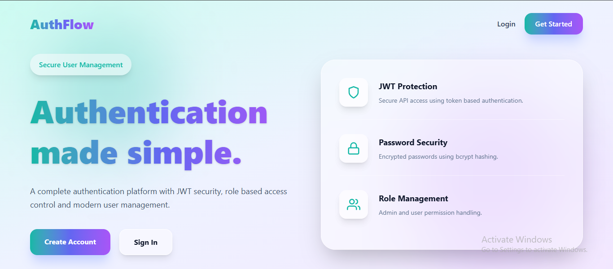
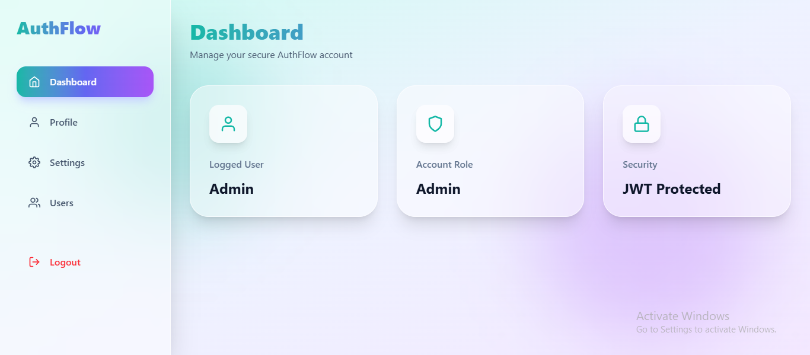
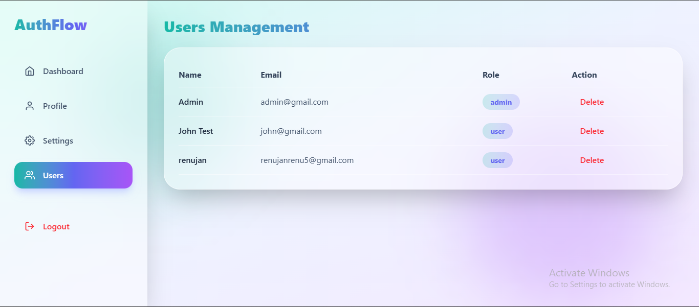

# AuthFlow - Authentication Based Platform


AuthFlow is a full-stack authentication and user management platform built using the MERN stack.  
The application provides secure login, registration, role-based authorization, profile management, and admin user controls with a modern responsive user interface.


## Features

### Authentication

- User Registration
- User Login
- JWT Authentication
- Protected Routes
- Persistent Login Sessions
- Secure Logout


### Security

- Password Hashing using bcrypt
- JWT Token Verification
- Role Based Access Control
- Protected API Endpoints
- Security Middleware Integration


### User Features

- Personal Dashboard
- View Profile
- Update Profile Details
- Change Password


### Admin Features

- Admin Dashboard Access
- View All Registered Users
- Delete Users
- Role Based Authorization


### UI Features

- Modern React Interface
- Responsive Design
- Glassmorphism Theme
- Reusable Components
- Toast Notifications
- Error Handling


## Tech Stack


### Frontend

- React.js
- Vite
- Tailwind CSS
- React Router DOM
- Axios
- Framer Motion
- React Icons
- React Hot Toast


### Backend

- Node.js
- Express.js
- MongoDB
- Mongoose
- JSON Web Token
- bcrypt
- Helmet
- Express Rate Limit


## Project Structure


```text
AuthFlow

├── client
│
│   ├── src
│   │
│   ├── components
│   ├── pages
│   ├── context
│   ├── services
│   └── layouts


├── server
│
│   ├── controllers
│   ├── models
│   ├── routes
│   ├── middleware
│   ├── config
│   └── server.js
```


## Installation


Clone repository

```bash
git clone your_repository_link
```


Install backend dependencies

```bash
cd server

npm install
```


Run backend

```bash
npm run dev
```


Install frontend dependencies

```bash
cd client

npm install
```


Run frontend

```bash
npm run dev
```


## Environment Variables


Backend `.env`

```env
PORT=5000

MONGO_URI=your_database_url

JWT_SECRET=your_secret_key
```


Frontend `.env`

```env
VITE_API_URL=http://localhost:5000/api
```


## API Endpoints


Authentication


| Method | Endpoint | Description |
|-|-|-|
| POST | /api/auth/register | Create Account |
| POST | /api/auth/login | Login User |


Users


| Method | Endpoint | Description |
|-|-|-|
| GET | /api/users/profile | Get Profile |
| PUT | /api/users/profile | Update Profile |
| PUT | /api/users/change-password | Change Password |
| GET | /api/users | Admin Get Users |
| DELETE | /api/users/:id | Admin Delete User |


## Screenshots


### Home Page




### Dashboard




### Admin Panel




## Future Improvements

- Email Verification
- Password Reset
- Two Factor Authentication
- OAuth Login


## Author

Developed as part of Full Stack Development Internship Program.
